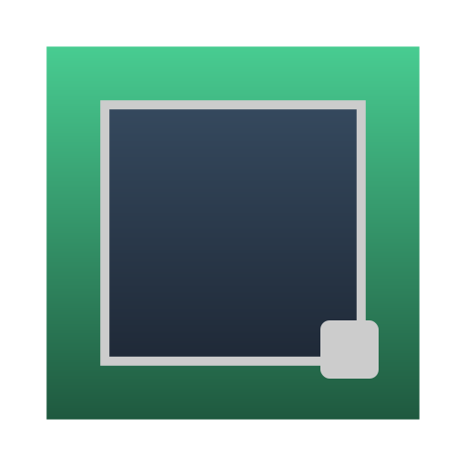

# Vue DNDNR

<p align="center">
  
  <br />
  👋↔️ a composable first draggable / resizable / droppable(more) Utilities for Vue3.
</p>

## 🚀 Features

- 🖱️ **Draggable**: Easily add drag functionality to any element with customizable constraints and events.
- ↔️ **Resizable**: Resize elements from any edge or corner with configurable minimum and maximum dimensions.
- 🧩 **Composable**: Use components directly or leverage TypeScript hooks for custom implementations.
- 📱 **Responsive**: Works on both desktop and mobile devices with touch support.
- 🔧 **Customizable**: Extensive styling options and configuration to match your design system.
- 📦 **Lightweight**: Minimal dependencies and tree-shakable for optimal bundle size.
- 🔒 **Type-Safe**: Built with TypeScript for better development experience and code reliability.
- 🎯 **Grid Snapping**: Ability to snap elements to a grid for precise positioning.
- 📏 **Bounds Constraints**: Restrict movement and resizing within defined boundaries.
- ♿ **Accessibility**: Enhanced keyboard navigation and ARIA attributes support.

## Installation

```sh
pnpm add vue-dndnr
```

or

```sh
npm install vue-dndnr
```

or

```sh
yarn add vue-dndnr
```

## Usage

### Hooks

```vue
<script setup>
import { ref } from 'vue'
import { useDnR } from 'vue-dndnr'

const elementRef = ref(null)

// Use the combined hook
const { position, size, isDragging, isResizing } = useDnR(elementRef, {
  initialPosition: { x: 0, y: 0 },
  initialSize: { width: 200, height: 150 },
})
</script>

<template>
  <div ref="elementRef" :style="{ left: `${position.x}px`, top: `${position.y}px` }">
    This element can be dragged and resized using hooks
  </div>
</template>
```

### Components

```vue
<script setup>
import { ref } from 'vue'
import { DnR, Draggable, Resizable } from 'vue-dndnr'

const position = ref({ x: 100, y: 100 })
const size = ref({ width: 200, height: 150 })
</script>

<template>
  <!-- Draggable component -->
  <Draggable v-model:position="position">
    <div>Drag me!</div>
  </Draggable>

  <!-- Resizable component -->
  <Resizable v-model:size="size" :min-width="100" :min-height="100">
    <div>Resize me!</div>
  </Resizable>

  <!-- Combined Drag and Resize component -->
  <DnR v-model:position="position" v-model:size="size">
    <div>Drag and resize me!</div>
  </DnR>
</template>
```

## ✨ Thanks To

This project is based on and inspired by the following projects:

- [vueuse/vueuse](https://github.com/vueuse/vueuse)
- [u3u/vue-hooks](https://github.com/u3u/vue-hooks)
- [sortablejs/vue.draggable.next](https://github.com/SortableJS/vue.draggable.next)
- [bcakmakoglu/revue-draggable](https://github.com/bcakmakoglu/revue-draggable)

## Guideline

This Project is strictly stands with the [Composable Vue](https://antfu.me/posts/composable-vue-vueday-2021) and Composition API of Vue 3.

## License

MIT
